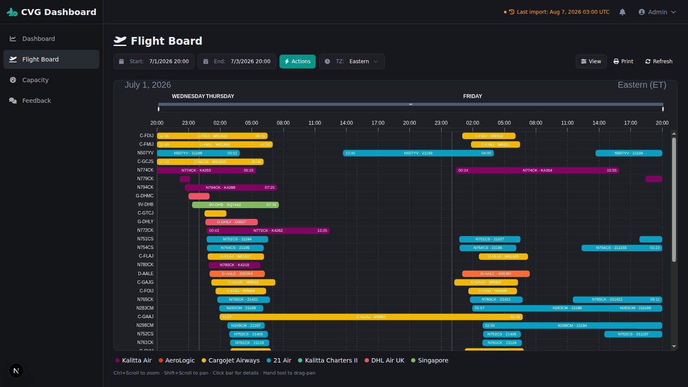
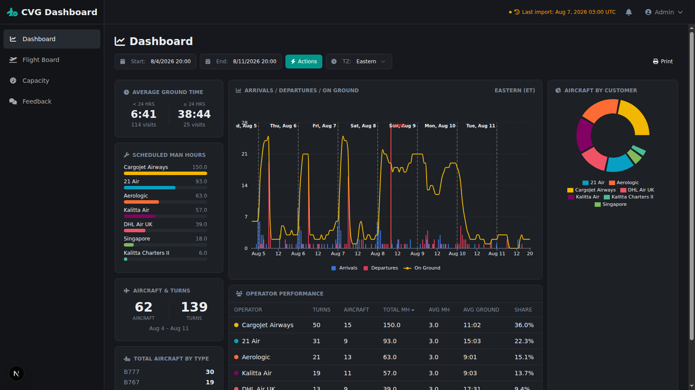
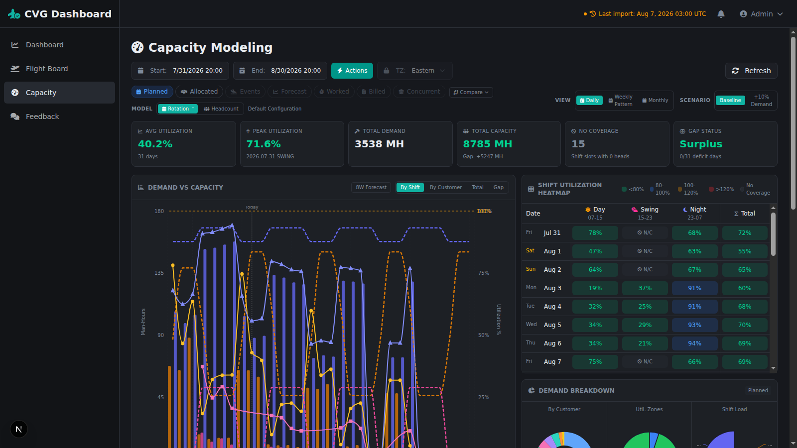
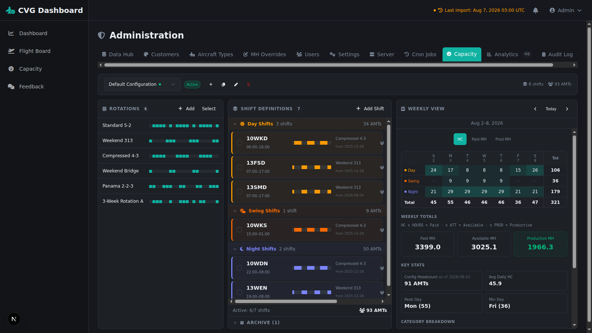

# DTS Dashboard

A **local-first** web application for airline line maintenance operations planning and capacity management. Built with Next.js, TypeScript, and modern web technologies.

## Overview

DTS Dashboard (DTSD) provides three core operational views for line maintenance planning:

1. **Flight Board** — Visual timeline (Gantt chart) showing aircraft ground windows and maintenance schedules
2. **Statistics Dashboard** — KPI cards, charts, and operational analytics
3. **Capacity Modeling** — Demand forecasting vs. available capacity for staffing decisions

The application ingests work package data, computes derived metrics (utilization, capacity, demand), and renders interactive visualizations — all running locally with no cloud dependencies.

## Screenshots

> Captured 2026-08-08 against a copy of production data (dark theme, the default).
> Operator names are real; no live URLs, tokens or user details appear.

### Flight Board

Gantt timeline of aircraft ground windows, one row per registration, coloured by customer. Ctrl+scroll to zoom, shift+scroll to pan, click a bar for detail.



### Statistics Dashboard

KPI cards, arrivals/departures/on-ground over time, and operator performance. Clicking an operator anywhere isolates it across every panel.



### Capacity Modeling

Demand against available capacity, with utilization heatmap by shift, gap analysis and six lenses (planned, allocated, events, forecast, worked, billed).



### Administration

Staffing configuration — rotation patterns, effective-dated shift definitions and the weekly headcount matrix, showing the paid → available → productive man-hour chain.



## Key Features

- **Local-First Architecture** — Runs entirely on your infrastructure, no external services required
- **Role-Based Access Control** — User, admin, and superadmin roles with granular permissions
- **Real-Time Filtering** — Global filter bar with 7 fields (date range, station, timezone, operator, aircraft, type)
- **Interactive Visualizations** — Apache ECharts Gantt timeline, Recharts analytics, TanStack tables
- **Theme Support** — 11 color presets with light/dark modes
- **Data Import** — JSON file upload, paste-import UI, and API endpoint for automation
- **Admin Console** — Customer management, user administration, analytics, audit logs
- **Responsive Design** — Desktop and mobile-optimized layouts

## Tech Stack

| Layer | Technology |
|-------|-----------|
| Framework | Next.js 16 (App Router, TypeScript) |
| UI Components | shadcn/ui + Radix UI |
| Styling | Tailwind CSS v4 |
| Theme | next-themes (dark default) |
| Charts | Recharts + Apache ECharts |
| Icons | Font Awesome 6 + Lucide |
| Tables | TanStack Table |
| State | Zustand |
| Auth | Auth.js (NextAuth v5) |
| Database | SQLite (better-sqlite3) |
| ORM | Drizzle ORM |

## Getting Started

### Prerequisites

- Node.js 20+ and npm
- Git

### Quick Start

```bash
git clone <repository-url>
cd dts-dash
npm install
npm run config:init
npm run build
npm start
```

On first launch, the application automatically initializes the database. The first registered user becomes the superadmin.

### Docker Deployment

```bash
docker build -t dtsd .
docker run -p 3000:3000 -v ./data:/app/data --env-file .env dtsd
```

See [docs/DEPLOYMENT.md](docs/DEPLOYMENT.md) for full deployment instructions including Docker Compose, PM2, reverse proxy, and environment configuration.

### Development

```bash
npm run dev        # Dev server at http://localhost:3000
npm run validate   # Full gate: typecheck -> lint -> test -> build
npm test           # Vitest only
npm run lint:fix   # ESLint with autofix
npm run format     # Prettier
```

`npm run validate` is the gate to run before committing. Two things worth knowing:

- **Check the exit code.** `next build` compiles first and type-checks second, so it can print `✓ Compiled successfully` and still fail with `Failed to type check` (exit 1). Piping the output to `tail` discards the exit code and makes a red build look green.
- **Vitest does not type-check.** Every test can pass while `tsc --noEmit` fails. Test files are inside `tsconfig.json`'s `include`, so adding a required field to a shared type breaks the build via stale fixtures without breaking a test. After changing a type in `src/types/`, grep `src/__tests__/` for fixtures of that type.

**WSL note** — if the repo lives on a Windows drive mount (`/mnt/c`, `/mnt/d`), `npm install` can fail with a misleading `EACCES` on a rename. It is a file lock, not a permission problem: some process (commonly a `tsserver` started from the project's own `node_modules`) is holding a package directory open. Close your editor or kill the language server, then retry. After moving the repo between drives, `rm -rf node_modules && npm install` — the `better-sqlite3` native bindings are path-sensitive.

### Database Management

```bash
npm run db:status          # Show database status
npm run db:seed            # Seed database with sample data
npm run db:backup          # Create timestamped backup
npm run db:export          # Export to JSON
npm run db:import          # Import from JSON
npm run db:superuser       # Create superuser
npm run db:reset           # Reset database
npm run db:reset-password  # Reset a user's password
npm run db:migrate         # Run schema migrations
```

## Project Structure

```
src/
├── app/                      # Next.js App Router pages
│   ├── login/                # Authentication
│   ├── register/             # Self-registration
│   ├── account/              # User account settings
│   ├── admin/                # Admin console
│   ├── api/                  # API route handlers
│   ├── flight-board/         # Flight board page
│   ├── dashboard/            # Statistics dashboard
│   └── capacity/             # Capacity modeling page
├── components/
│   ├── ui/                   # shadcn/ui components
│   ├── layout/               # Header, sidebar, navigation
│   ├── shared/               # FilterBar, DateTimePicker, etc.
│   ├── flight-board/         # Gantt chart components
│   ├── dashboard/            # KPI cards and charts
│   └── admin/                # Admin console components
├── lib/
│   ├── auth.ts               # Auth.js configuration
│   ├── db/                   # Database schema and queries
│   ├── data/                 # Data transformation logic
│   ├── hooks/                # Zustand stores
│   └── utils/                # Utility functions
├── types/                    # TypeScript type definitions
└── middleware.ts             # Route protection

data/                         # SQLite database (auto-created)
docs/                         # Operational documentation
scripts/db/                   # Database CLI tools
docker/                       # Docker Compose examples and env templates
```

## Configuration

### Environment Variables

See [docker/.env.example](docker/.env.example) for the complete environment variable reference.

Key variables:
- `AUTH_SECRET` — Session signing secret (required, 32+ chars)
- `BASE_URL` — Application base URL (default: `http://localhost:3000`)
- `DATABASE_PATH` — SQLite database path (default: `data/dashboard.db`)

### System Configuration

Server-side settings are managed via `server.config.yml`. Run `npm run config:init` to generate the default configuration file.

Admin-configurable settings (via the web UI):
- **Customer Colors** — Visual coding for maintenance customers
- **Aircraft Type Mapping** — Normalization rules for aircraft model names
- **User Preferences** — Timezone, theme, pagination per user
- **Invite Codes** — Self-registration access control

## Documentation

- [DEPLOYMENT.md](docs/DEPLOYMENT.md) — Deployment guide (Docker, PM2, systemd, reverse proxy)
- [BACKUP.md](docs/BACKUP.md) — Backup procedures and restore steps
- [MONITORING.md](docs/MONITORING.md) — Health checks, log analysis, incident response

## License

This project is licensed under the Apache License 2.0 — see the [LICENSE](LICENSE) file for details.
